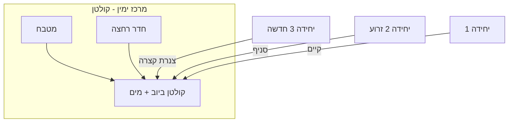

# דוח סקר — נכס בצורת L (מישור אחד)

**תאריך:** 7 ביוני 2026  
**נכס:** 62.75 מ"ר בנוי + 160 מ"ר חצר  
**מטרה:** פיצול ל-3–4 יחידות דיור

---

## 1. נתוני שטח (מאושרים — גרסה 3.3)

| פרמטר | ערך | מקור |
|--------|-----|------|
| שטח בנוי רשום | **62.75 מ"ר** | בעלים |
| שטח חצר | **160 מ"ר** | בעלים |
| רוחב כולל (קיר → גדר + זנב) | **9.9 מ'** | מדידה |
| עומק רצועה עליונה (מבנה → גדר) | **4.8 מ'** | מדידה — ללא בליטת מרפסת |
| עומק זנב ימני (מבנה → גדר) | **2.9 מ'** | מדידה |
| אורך קצר (כולל מבנה, עד תחתית ממ"ד) | **12.3 מ'** | מדידה — בחלק ברוחב 3.17 מ' |
| רוחב בחלק הקצר (קיר → תחתית ממ"ד) | **3.17 מ'** | מדידה |
| זנב ארוך (מאז הממ"ד לאורך הגדר) | **15.6 מ'** | מדידה |
| שיפוע קרקע | **מישור אחד** | בעלים — אין מדרון |

### חישוב גיאומטרי (תוכנית 3.4 — לפי שרטוט המדידה)

```
רוחב כולל (מבנה + חצר ימין) = 9.9 מ'
רוחב מבנה ראשי              = 6.73 מ'
רוחב חצר ימין                = 2.9 מ'   (6.73 + 2.9 = 9.9)
עומק מבנה ראשי               = 12.3 − 4.8 = 7.5 מ'
אורך צד שמאל (כולל חצר עליונה) = 12.3 מ'
אורך צד ימין (חצר מלאה)     = 15.6 מ'
תחתית מבנה (רוחב מלא)       = 3.17 + 6.73 = 9.9 מ'
```

> **הבהרה:** 15.6 מ' = **כל** אורך הצד הימני (חצר צהובה/ירוקה), לא תוספת מאחורי הממ"ד.  
> 12.3 מ' = אורך הצד השמאלי עד סוף המבנה.  
> החצר מימין מתחילה מקדימה (קו 0) ליד המבנה; מתחת לממ"ד נשארת חצר בלבד (ללא בליטת מבנה).

---

## 2. פירוק שטחים קיימים (הערכה מתוכנית)

| אזור | שטח משוער | תפקיד היום | הערות |
|------|-----------|------------|--------|
| סלון שמאל | 20–22 מ"ר | מגורים | החדר הגדול ביותר |
| מרפסת / פטיו עליון | 6–8 מ"ר | חיבור לסלון | בליטה לתוך 4.8 מ' |
| מטבח מרכזי | 8–10 מ"ר | בישול | **צמוד לקולטן** |
| חדר רחצה | 5–6 מ"ר | אמבטיה + שירותים | **קולטן ראשי** |
| חדר עליון ימין | 12–14 מ"ר | ריק / שינה | חלון לזנב |
| זרוע תחתונה (חדר שינה) | 10–12 מ"ר | שינה | זרוע נפרדת — פוטנציאל יחידה |
| **סה"כ** | **~62.75 מ"ר** | | |

---

## 3. מיקום קולטן (אינסטלציה) — קריטי



**מסקנות:**
- הקולטן ממוקם במרכז-ימין (בין מטבח לאמבטיה).
- יחידה 3 (בנייה חדשה) — לבנות **צמוד לקיר המטבח/אמבטיה** ברצועה העליונה.
- יחידה 2 (זרוע) — סניף צנרת קצר דרך הקיר המשותף; להחליף אמבטיה במקלחון (חוסך ~1.5 מ"ר).
- **לא** להעביר קולטן לקצה החצר — עלות גבוהה וסיכון שיפועים.

### רשימת בדיקה לפני שבירה (על ידי אינסטלטור / מהנדס)

- [ ] פתיחת גישה לקולטן ואימות מיקום מדויק
- [ ] בדיקת קוטר צנרת קיים (מינימום 50 מ"מ ביוב)
- [ ] מדידת שיפוע ביוב קיים (מינימום 2%)
- [ ] אימות לחץ מים (ליחידה 3 עם מקלחון + מטבח)
- [ ] תכנון מונה מים נפרד לכל יחידה

---

## 4. קירות תומכים — סימון לבדיקה

> **אזהרה:** לפני הריסת כל קיר — אישור מהנדס קונסטרוקציה חובה.

| קיר חשוד | מיקום | סיכון | פעולה מומלצת |
|----------|--------|--------|--------------|
| קיר אורך בין סלון למטבח | שמאל-מרכז | **גבוה** | בדיקה לפני פתיחה; אם תומך — פתח בלבד |
| קיר רוחב מעל מטבח/אמבטיה | מרכז | **בינוני** | ייתכן קורה — לא להסיר ללא תכנון |
| קיר הפרדה לזרוע תחתונה | תחתון-ימין | **נמוך** | סביר שאינו תומך — לאשר עם מהנדס |
| קיר חיצוני זרוע | ימין-תחתון | **גבוה** | לא לפתוח חורים גדולים ללא חיזוק |
| קיר עליון (פטיו) | שמאל-עליון | **בינוני** | בליטת מרפסת — ייתכן קורת תמיכה |

### כללי בטיחות
1. לא סותמים חלונות קיימים בלי תכנון אוורור חלופי.
2. כל חדר שינה — חלון לפי תקן (מינימום ~10% משטח רצפה).
3. קירות הפרדה בין יחידות — בידוד אקוסטי (מינימום 5–7 ס"מ בטון / בלוקים).

---

## 5. כניסות קיימות ומתוכננות

| כניסה | מיקום | סטטוס | יחידה |
|--------|--------|--------|--------|
| עורף | תחתית סלון | **קיים** | יחידה 1 |
| זנב ימני | שביל 1.0–1.2 מ' | **מתוכנן** | יחידה 2 |
| רצועה עליונה | חזית 4.8 מ' | **מתוכנן** | יחידה 3 |

**עקרון:** אף דייר לא עובר דרך דירת דייר אחר.

---

## 6. תקנות ישראל — מינימומים לתכנון

| אלמנט | מינימום |
|--------|---------|
| חדר שינה | 8–9 מ"ר + חלון |
| סלון+מטבח | 18–22 מ"ר (נוח) |
| שירותים + מקלחת | 3–4 מ"ר |
| מסדרון | 90 ס"מ |
| דלת כניסה | 80 ס"מ |
| דלת פנימית | 70 ס"מ |

---

## 7. המלצות מיידיות לפני תחילת עבודה

1. **מדידת מדידות מקצועית** — לקבלת מידות מדויקות לכל קיר.
2. **ביקור מהנדס** — סימון קירות תומכים בצבע על הקירות.
3. **בדיקת אינסטלטור** — אימות קולטן ותכנון סניפים ליחידות 2 ו-3.
4. **צילום תיעוד** — כל הקירות, הצנרת והחלונות לפני הריסה.

**עלות משוערת לסקר:** 2,000–5,000 ₪ (מדידה + ייעוץ מהנדס + אינסטלטור).
